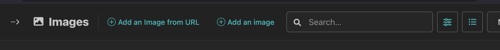
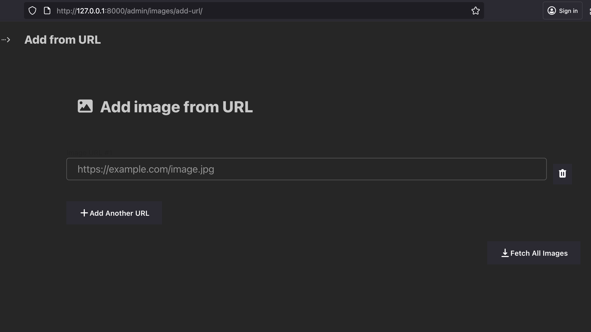

# Wagtail Image From URL

A Wagtail plugin that allows you to import images directly from URLs into your image library.

## Features

- Import multiple images from URLs in a single submission
- Integrated into the Wagtail admin interface
- Real-time status indicators for each URL
- Client-side and server-side URL validation
- 10 MB file size limit per image
- Support for JPEG, PNG, GIF, BMP, and WEBP formats
- AJAX-based submission without page reload
- Dynamic URL field management

## Requirements

- Python 3.10+
- Django 4.2+
- Wagtail 5.0+
- `requests` - For HTTP operations
- `Pillow` - For image validation and processing

## Installation

### Install the Package

Install from PyPI:

```bash
  pip install wagtail-image-from-url
```

Or install from GitHub:

```bash
  pip install git+https://github.com/awais786/wagtail-image-from-url.git@main
```

### Add to Installed Apps

Add `image_url_upload` to your Django `INSTALLED_APPS` in `settings.py`:

```python
INSTALLED_APPS = [
    # ... other apps
    'wagtail.admin',
    'wagtail',    
    'image_url_upload',  # ← Add this line
]
```

Static files will be automatically discovered by Django's staticfiles system.

## Usage

1. Navigate to the Wagtail admin and click "Images" in the sidebar

2. Click "Add an Image from URL" button in the images index page header

   

3. Enter image URLs:
   - Enter one or more image URLs
   - Each image must be 10 MB or smaller
   - Click "Add Another URL" to add more fields
   - Remove unwanted fields using the trash icon


4. Click "Fetch All Images" to import all images


   


5. View real-time status updates next to each URL field

## Testing

Run the test suite:

```bash
# Install test dependencies
pip install pytest pytest-django

# Run tests
pytest
```

## Development Setup

```bash
# Clone the repository
git clone https://github.com/awais786/wagtail-image-from-url.git
cd wagtail-image-from-url

# Create a virtual environment
python -m venv venv
source venv/bin/activate  # On Windows: venv\Scripts\activate

# Install package in editable mode
pip install -e .

# Install test/development tools (optional)
pip install pytest pytest-django black flake8

# Run tests
pytest
```

## License

This project is licensed under the MIT License - see the [LICENSE](LICENSE) file for details.

## Support

- Issues: [GitHub Issues](https://github.com/awais786/wagtail-image-from-url/issues)
- Discussions: [GitHub Discussions](https://github.com/awais786/wagtail-image-from-url/discussions)
- Wagtail Slack: [#packages channel](https://wagtail.org/slack/)

## Changelog

### Version 1.0.1 (Current)
- Production-ready release
- Bulk URL import functionality
- Real-time status feedback
- Support for JPEG, PNG, GIF, BMP, and WEBP formats
- 10 MB file size limit
- Smart filename extraction with fallbacks
- Content-type validation
- Timeout protection (10 seconds)
- Comprehensive error handling

For detailed changelog, see [CHANGELOG.md](CHANGELOG.md)

## Contributing

Contributions are welcome! Please feel free to submit a Pull Request. For major changes, please open an issue first to discuss what you would like to change.
